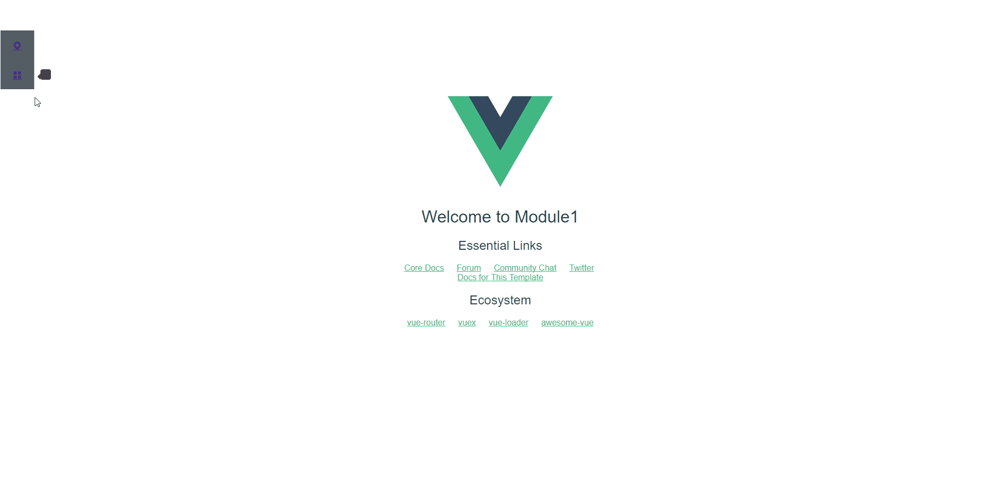

# multiWebpack

## 建议使用 `vue-cli@3`，此仓库不再维护 。

> 基于vue-cli的多入口webpack脚手架



## 特点

* 完全复用(抄袭)vue-cli的配置,在此基础上少量侵入代码即可更改为多页面配置
* 不用担心脚手架更新维护问题,受益于vue-cli的更新
## 改动

* 新增```build/multi-helper.js```用于生成多入口和html打包
* ```build/webpack.base.conf```改动
```javascript
const multiHelper = require('./multi-helper')

module.exports = {
  entry: multiHelper.getEntry(),
  plugins: multiHelper.generateTemplate()
}
```
## 项目结构

``` bash
.
├── build/                      # webpack config files
│   └── ...
├── config/
│   ├── index.js                # main project config
│   └── ...
├── dist/
├── ——module1/                  # html file
├── ——module2/                  # html file
├── ——static/                   # assets js css fonts etc.... and some assets copy from /static
├── src/
├── ——module1/
│   ├── main.js                 # app entry file
│   ├── App.vue                 # main app component
│   ├── components/             # ui components
│   │   └── ...
│   └── assets/                 # module assets (processed by 
├── ——module2/
│   ├── main.js                 # app entry file
│   ├── App.vue                 # main app component
│   ├── components/             # ui components
│   │   └── ...
│   └── assets/                 # module assets (processed by webpack)
│       └── ...
├── static/                     # pure static assets (directly copied)
├── test/
│   └── unit/                   # unit tests
│   │   ├── specs/              # test spec files
│   │   ├── eslintrc            # config file for eslint with extra settings only for unit tests
│   │   ├── index.js            # test build entry file
│   │   ├── jest.conf.js        # Config file when using Jest for unit tests
│   │   └── karma.conf.js       # test runner config file when using Karma for unit tests
│   │   ├── setup.js            # file that runs before Jest runs your unit tests
│   └── e2e/                    # e2e tests
│   │   ├── specs/              # test spec files
│   │   ├── custom-assertions/  # custom assertions for e2e tests
│   │   ├── runner.js           # test runner script
│   │   └── nightwatch.conf.js  # test runner config file
├── .babelrc                    # babel config
├── .editorconfig               # indentation, spaces/tabs and similar settings for your editor
├── .eslintrc.js                # eslint config
├── .eslintignore               # eslint ignore rules
├── .gitignore                  # sensible defaults for gitignore
├── .postcssrc.js               # postcss config
├── index.html                  # index.html template
├── package.json                # build scripts and dependencies
└── README.md                   # Default README file
```

## 使用

``` bash
# install dependencies
npm install

# serve with hot reload at localhost:8080
npm run dev
# build for production with minification
npm run build

# build for production and view the bundle analyzer report
npm run build --report
```
打开```http://localhost:8080/module1#/```就能看到页面啦~
